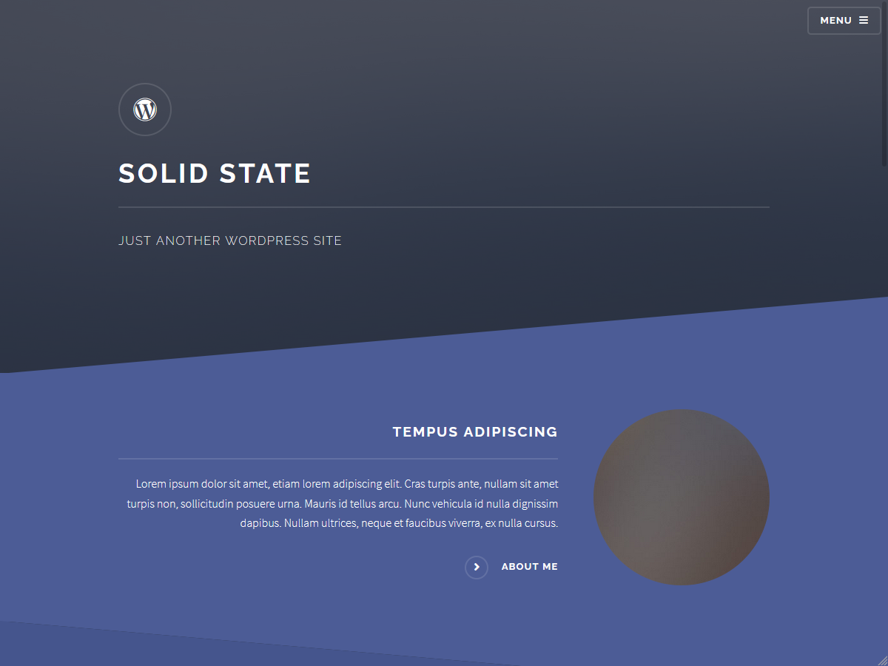

# Solid State (Wordpress)

Solid State (Wordpress) is a wordpress theme modified from Solid State HTML template created by [HTML5 UP](http://html5up.net/).

You can use the theme for any purposes unless it is prohibited by HTML5 UP.

## Preview

Live Demo: [https://wordpress.sze-to.com](https://wordpress.sze-to.com)

## Features

Customize everything in Wordpress customizer, including:

* Front Page Icon

* Front Page Introduction Sessions

* Front Page Articles

* HTML footer / 1-4 columns footer.

## How To Install

1. Download the zip file from github

2. Upload and activate the theme in your wordpress backend

3. Create two empty pages, one named Blog (better to change its permalink to blog) and the other one just name it whatever you like (For example Home).

4. Go to settings->reading, change "Your homepage displays" option to "A static page"

5. "Homepage" --> "Home", "Posts page" --> "Blog", save it after you done

## License

As inherited from HTML5 UP, this theme remains in [The Creative Commons Attribution 3.0 License](http://creativecommons.org/licenses/by/3.0/).

That means, you can

* Use them for personal stuff

* Use them for commercial stuff

* Change them however you like

But you need to give credit to HTML5 UP and me (included in footer as default).
